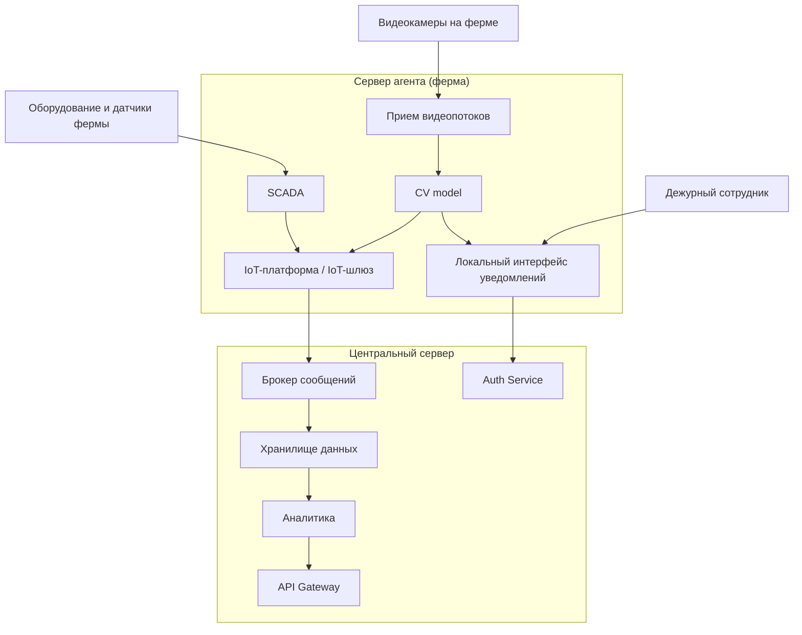

# ADR-<1>: <Размещение контура видеоаналитики и локального реагирования на сервере-агенте фермы>

**Статус:** ✅ Принято  
**Участники:** Архитектор решения, технический лидер платформы, представитель бизнеса АгроТех Х, инженер эксплуатации, инженер по данным  
**Дата:** 2026-03-30  

---

## 1. Контекст

Текущая архитектура АгроТех Х не позволяет гарантированно обеспечить необходимую скорость обработки событий на ферме и устойчивое реагирование при нестабильной связи с центральной системой.

Система должна анализировать видеопоток с камер, выявлять нештатные ситуации в животноводстве и уведомлять дежурного сотрудника не позднее чем через 5 секунд после фиксации инцидента. При этом видеоаналитика должна работать в режиме, близком к реальному времени, а сама система — сохранять работоспособность даже при отсутствии интернета.

Для бизнеса важно выбрать архитектурный вариант, который не только решает задачу функционально, но и даёт предсказуемый баланс между скоростью реакции, стоимостью внедрения, сложностью сопровождения и масштабированием на новые фермы.

Рассматривались два варианта:
1. **Edge-first** — логика видеоаналитики и локального реагирования размещается на сервере-агенте на ферме.
2. **Central-first** — логика видеоаналитики и реагирования размещается в центральном сервере, а на ферме остаются сбор данных, SCADA, буферизация и синхронизация.

---

## 2. Требования

### Функциональные

**FURPS+**:

| Категория | Требование |
|---|---|
| **F**unctional | Получать видеопотоки с камер разных производителей; выявлять драки, беспокойство, задавливание поросят, болезнь, гибель; пересчитывать поголовье; собирать телеметрию с кормушек, поилок, систем фильтрации воды и запасов еды; поддерживать API для web/mobile; передавать события и метрики в центральную платформу |
| **U**sability | Дежурный сотрудник должен быстро получать понятные уведомления об инцидентах и видеть их в интерфейсе мониторинга |
| **R**eliability | Система должна продолжать работу на ферме даже при потере связи с центральной платформой и синхронизироваться после её восстановления |
| **P**erformance | Видеоаналитика должна обрабатывать поток с минимальной задержкой; оповещение должно формироваться не позднее 5 секунд |
| **S**upportability | Решение должно позволять дорабатывать существующие IoT/SCADA/хранилища и развивать новые сервисы без полного пересмотра архитектуры |

### Нефункциональные

| Категория | Требование | Критичность |
|---|---|---|
| Производительность | От момента возникновения нештатной ситуации, зафиксированной с помощью видеоаналитики, должно проходить не более 5 секунд до момента оповещения | Высокая |
| Производительность | Видеоаналитика должна реагировать в реальном времени, с задержкой порядка миллисекунд на критическом контуре | Высокая |
| Надёжность | Система должна работать при отсутствии интернета и синхронизироваться с центральной системой после восстановления связи | Высокая |
| Отказоустойчивость | Требуемая доступность платформы — 99,95% | Высокая |
| Масштабируемость | Архитектура должна поддерживать рост числа ферм и камер без пересмотра базового решения | Средняя |
| Расширяемость | Новый функционал должен добавляться без существенного изменения уже существующих компонентов | Высокая |
| Безопасность | Должны поддерживаться ролевой доступ, аутентификация и авторизация пользователей | Высокая |

---

## 3. Решение

### Концептуальная работа решения

На каждой ферме разворачивается **сервер-агент**, который принимает видеопотоки с камер, выполняет обработку видео и локальную видеоаналитику, получает телеметрию от оборудования через IoT/SCADA-контур и при обнаружении инцидента сразу отправляет уведомление дежурному сотруднику на месте. Таким образом, критичный путь «камера → анализ → тревога» не зависит от доступности внешнего канала связи.

Параллельно сервер-агент публикует события, метрики и телеметрию в центральную платформу. Если связь с центром недоступна, данные временно накапливаются локально и повторно отправляются после восстановления соединения. Центральный сервер отвечает за долговременное хранение, агрегированную аналитику, прогнозирование расхода еды, API, BI и управление доступом.

### Описание

Было принято выбрать **вариант Edge-first**: разместить критичный по задержке контур на сервис-агенте фермы — приём видеопотока, обработку видео, AI-видеоаналитику, локальный интерфейс оповещения, локальную буферизацию и синхронизацию. Центральный сервер сохраняет функции корпоративной интеграции, хранения, аналитики, API и управления доступом.

Это решение соответствует ключевой бизнес-цели: минимизировать потери поголовья за счёт быстрого локального обнаружения инцидентов и немедленного уведомления сотрудника на месте.

### Аргументация

| Критерий | Обоснование |
|---|---|
| Выполнение SLA по оповещению не более 5 секунд | Локальная обработка на ферме исключает критическую зависимость от связи с центральным сервером и сокращает длину критического пути |
| Реакция видеоаналитики в реальном времени | Передача видеоданных внутри локального контура позволяет минимизировать задержку по сравнению с централизованной обработкой |
| Автономность при отсутствии связи | Локальный контур на ферме продолжает анализировать видео и показывать инциденты сотруднику даже при отсутствии связи |
| Поддержка принципа «центральный сервер — агенты» | Сервер-агент реализует локальную обработку, а центральная платформа агрегирует данные и управляет корпоративными сервисами |
| Переиспользование исторического ландшафта | IoT-шлюз, SCADA, Kafka, Data Lake, DWH и аналитика не заменяются полностью, а переиспользуются и дорабатываются |
| Масштабирование на новые фермы | Каждая новая ферма добавляет типовой агент без полного пересмотра центральной архитектуры |

#### Последствия

**✅ Положительные:**
- Архитектура соответствует ключевым требованиям по задержке и локальному реагированию
- Снижается зависимость оповещения от качества интернет-канала
- Локальное уведомление сотрудника работает даже при отсутствии связи с центром
- В центр передаются уже события, метрики и агрегаты, а не полный видеопоток
- Исторические корпоративные компоненты могут быть переиспользованы

**⚠️ Негативные:**
- Стоимость внедрения и поддержки возрастает из-за размещения AI-контура на каждой ферме
- Усложняется эксплуатация распределённой edge-инфраструктуры
- Обновление моделей и ПО на множестве ферм требует отдельного процесса доставки и контроля версий
- Появляется необходимость в локальной буферизации и гарантированной повторной отправке данных

**↗️ Зависимости:**
- Доработка существующего IoT-шлюза под маршрутизацию событий и метрик с фермы
- Интеграция SCADA с локальным edge-контуром и центральной шиной данных
- Организация централизованного управления версиями CV model и конфигурацией агентов
- Реализация защищённого API и авторизации для web/mobile и локального интерфейса

---

## 4. Альтернативы

| Вариант | Плюсы | Минусы | Почему отклонён |
|---|---|---|---|
| Разместить логику видеоаналитики и реагирования в центральном сервере | Проще сопровождать AI-модели и обновлять ПО; меньше вычислительная нагрузка на фермах; централизованный контроль | Высокая зависимость от качества связи; рост сетевого трафика из-за передачи видео; риск не выполнить требования по миллисекундной реакции и оповещению за 5 секунд; снижение автономности фермы | Не обеспечивает надёжное выполнение критичных бизнес-требований по сохранению поголовья и быстрому реагированию |

---

## 5. Риски

1. **Недостаточная производительность edge-сервера на ферме**  
   *Меры:* зафиксировать минимальные требования к CPU/GPU и памяти; провести нагрузочное тестирование на целевом количестве камер; предусмотреть деградационные режимы и масштабирование по edge-устройствам.

2. **Сложность централизованного обновления AI-моделей и конфигураций на множестве ферм**  
   *Меры:* внедрить централизованный процесс rollout/rollback версий, контроль совместимости моделей и конфигураций, журнал версий и поэтапное обновление по группам ферм.

3. **Потеря или задержка синхронизации данных между фермой и центральной платформой**  
   *Меры:* использовать локальную буферизацию событий на агенте, гарантированную повторную отправку после восстановления связи, мониторинг отставания синхронизации и алерты на сбои интеграции.

4. **Ошибки ложного срабатывания видеоаналитики на раннем этапе MVP**  
   *Меры:* задать пороги уверенности модели, предусмотреть ручную верификацию части инцидентов, собирать датасет реальных срабатываний и дообучать модель по итогам эксплуатации.

5. **Отказ локального контура оповещения на ферме**  
   *Меры:* использовать локальный сервис восстановления, health-checks для критичных сервисов и резервный сценарий отображения тревог в интерфейсе.