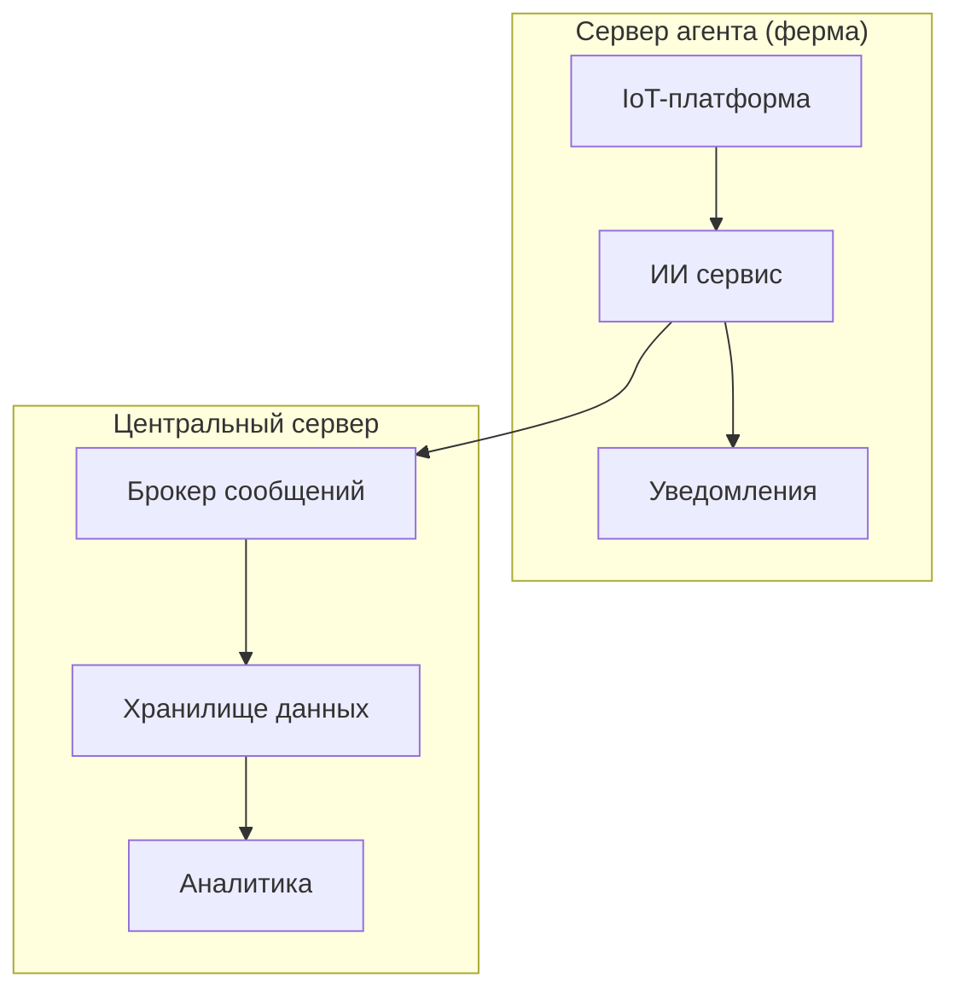

# ADR-<1>: <Краткое описательное название>

**Статус:** ✅ Принято | ⚠️ На рассмотрении | ❌ Отклонено  
**Участники:** <Имена и роли>  
**Дата:** <ГГГГ-ММ-ДД>  

---

## 1. Контекст
Текущая архитектура АгроТех Х не позволяет обеспечить необходимую скорость обработки событий на ферме 

---

## 2. Требования

### Функциональные
<Используйте один из форматов>

**FURPS+**:
| Категория       | Требование                  |
|-----------------|-----------------------------|
| **F**unctional  | <Функциональные возможности>|
| **U**sability   | <Требования к UX/UI>        |

**Или Use Cases**:
| UC-ID | Название | Основной поток | Альтернативные потоки |

### Нефункциональные
| Категория       | Требование                                                                                                                                      | Критичность |
|-----------------|-------------------------------------------------------------------------------------------------------------------------------------------------|------------|
|Производительность| от момента возникновения нештатной ситуации, зафиксированной с помощью видеоаналитики, должно проходить не более 5 секунд до момента оповещения | Высокая   |

---

## 3. Решение

### Описание
Было принято разработать системы IoT, ИИ сервис и Брокер сообщений на сервис-агентах

### Аргументация

| Критерий                                                                                                                         | Обоснование                                                                                                      |
|----------------------------------------------------------------------------------------------------------------------------------|------------------------------------------------------------------------------------------------------------------|
| высокая производительность — от момента возникновения нештатной ситуации, зафиксированной с помощью видеоаналитики, должно проходить не более 5 секунд до момента оповещения; | Использование текущей архитектуры не позволяет обеспечивать требуемую скорость реагирования системы на инциденты | |                                                                                               |                                                                                                                  |

#### Последствия

**✅ Положительные:**
- Скорость реагирования системы на нештатные ситуации увеличилась
- Количество погибшего скота уменьшилось

**⚠️ Негативные:**
- Стоимость поддержки системы увеличена из-за распределенных сервисов ИИ и брокера-сообщений

**↗️ Зависимости:**
- 

---

### 4. Альтернативы

| Вариант                                                      | Плюсы                                       | Минусы                                                                                                      | Почему отклонен                                                                  |
|--------------------------------------------------------------|---------------------------------------------|-------------------------------------------------------------------------------------------------------------|----------------------------------------------------------------------------------|
| Разместить ИИ-сервис в центральном сервере | Сложность и стоимость поддержки уменьшается | Не обеспечивается необходимое быстродействие системы (реагирование видеоаналитики в реальном времени (млс)) | Важно выполнять основную бизнес-задачу качественно - сохранение поголовья скота. |

---

### 5. Риски

1. **<Название риска>**  
   *Меры:* 

2. **<Название риска>**  
   *Меры:* 

3. **<Название риска>**  
   *Меры:* 