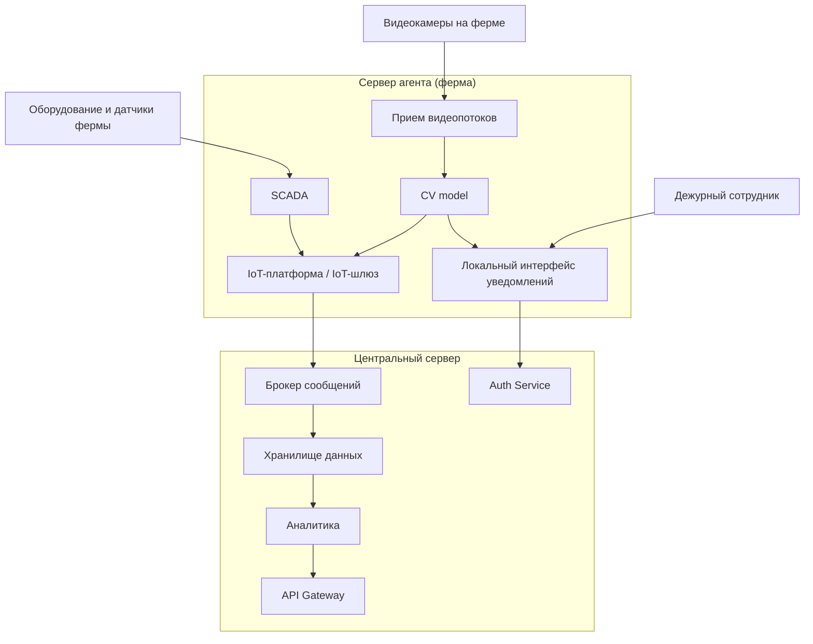

# ADR-2: Размещение контура видеоаналитики и локального реагирования на сервере-агенте фермы

**Статус:** ✅ Принято  
**Участники:** Архитектор решения, технический лидер платформы, представитель бизнеса АгроТех Х, инженер эксплуатации, инженер по данным  
**Дата:** 2026-03-30  

---

## 1. Контекст

Текущая архитектура АгроТех Х не позволяет гарантированно обеспечить необходимую скорость обработки событий на ферме и устойчивое локальное реагирование при нестабильной связи с центральной системой.

Система должна анализировать видеопоток с камер, выявлять нештатные ситуации в животноводстве и уведомлять дежурного сотрудника не позднее чем через 5 секунд после фиксации инцидента. При этом видеоаналитика должна работать в режиме, близком к реальному времени, а сама система — сохранять работоспособность даже при отсутствии интернета.

Исторический ландшафт содержит полезные заделы в виде IoT-платформы, SCADA, брокера сообщений, аналитического контура и хранилищ данных. Однако для нового сценария мониторинга скота требуется определить, какие компоненты должны быть размещены на ферме, а какие — в центральном сервере.

---

## 2. Требования

### Функциональные

**FURPS+**:

| Категория | Требование |
|---|---|
| **F**unctional | Получать видеопотоки с камер разных производителей; выявлять драки, беспокойство, задавливание поросят, признаки болезни и гибели; собирать телеметрию с кормушек, поилок, систем фильтрации воды и запасов еды; передавать события и метрики в центральную платформу; предоставлять API для web/mobile |
| **U**sability | Дежурный сотрудник должен быстро получать понятные уведомления об инцидентах и видеть их в интерфейсе мониторинга |
| **R**eliability | Система должна продолжать работу на ферме даже при потере связи с центром с последующей синхронизацией |
| **P**erformance | Видеоаналитика должна обрабатывать поток локально с минимальной задержкой; оповещение должно формироваться не позднее 5 секунд |
| **S**upportability | Решение должно позволять дорабатывать существующие IoT/SCADA/хранилища и развивать новые сервисы без полного пересмотра архитектуры |

### Нефункциональные

| Категория | Требование | Критичность |
|---|---|---|
| Производительность | От момента возникновения нештатной ситуации, зафиксированной с помощью видеоаналитики, должно проходить не более 5 секунд до момента оповещения | Высокая |
| Производительность | Видеоаналитика должна реагировать в реальном времени, с задержкой порядка миллисекунд на критическом локальном контуре | Высокая |
| Надёжность | Система должна работать при отсутствии интернета и синхронизироваться с центральной системой после восстановления связи | Высокая |
| Отказоустойчивость | Требуемая доступность платформы — 99,95% | Высокая |
| Масштабируемость | Архитектура должна поддерживать рост числа ферм и камер без пересмотра базового решения | Средняя |
| Расширяемость | Новый функционал должен добавляться без существенного изменения уже существующих компонентов | Высокая |
| Безопасность | Должны поддерживаться ролевой доступ, аутентификация и авторизация пользователей | Высокая |

---

## 3. Решение

### Описание

Было принято разместить **критичный по задержке контур** на сервис-агенте фермы: приём видеопотока, AI-видеоаналитику и локальный интерфейс оповещения. Центральный сервер сохраняет функции корпоративной интеграции, хранения, аналитики, API и управления доступом.

Существующие компоненты используются так:
- **дорабатываются**: IoT-шлюз, SCADA, аналитический контур, интеграция с центральными хранилищами;
- **разрабатываются заново**: CV model для видеоаналитики и локальный контур отображения инцидентов.

### Аргументация

| Критерий | Обоснование |
|---|---|
| высокая производительность — от момента возникновения нештатной ситуации, зафиксированной с помощью видеоаналитики, должно проходить не более 5 секунд до момента оповещения | Размещение приёма видеопотоков, CV model и локального интерфейса уведомлений на ферме исключает критическую зависимость от канала связи с центральным сервером и уменьшает длину критического пути |
| видеоаналитика должна реагировать в реальном времени | Передача видеоданных внутри сервера-агента по локальным высокоскоростным протоколам позволяет избежать сетевых задержек, характерных для централизованной обработки |
| работа при отсутствии интернета | Локальный контур на ферме продолжает принимать видео, выполнять inference и показывать инциденты сотруднику даже при отсутствии связи с центральной платформой |
| использование исторического ландшафта | IoT-шлюз, SCADA, Kafka, Data Lake, DWH и аналитика не заменяются полностью, а переиспользуются и дорабатываются |
| разделение ответственности | Edge-контур отвечает за быстрые локальные реакции, центральный контур — за интеграцию, хранение, отчётность, BI, API и управление доступом |

#### Последствия

**✅ Положительные:**
- Архитектура соответствует ключевым требованиям по задержке и локальному реагированию
- Снижается зависимость оповещения от стабильности интернет-канала
- В центр передаются уже события, метрики и агрегаты, а не полный видеопоток
- Исторические корпоративные компоненты могут быть переиспользованы

**⚠️ Негативные:**
- Стоимость внедрения и поддержки возрастает из-за размещения AI-контура на каждой ферме
- Усложняется эксплуатация распределённой edge-инфраструктуры
- Обновление моделей и программного обеспечения на множестве ферм требует отдельного процесса доставки и контроля версий

**↗️ Зависимости:**
- Доработка существующего IoT-шлюза под маршрутизацию событий и метрик с фермы
- Интеграция SCADA с локальным edge-контуром и центральной шиной данных
- Организация централизованного управления версиями CV model и конфигурацией агентов
- Реализация защищённого API и авторизации для web/mobile и локального интерфейса

---

## 4. Альтернативы

| Вариант | Плюсы | Минусы | Почему отклонён |
|---|---|---|---|
| Разместить CV model и сервис уведомлений в центральном сервере | Проще сопровождать AI-модели и обновлять ПО; меньше вычислительная нагрузка на фермах; централизованный контроль | Высокая зависимость от качества связи; рост сетевого трафика из-за передачи видео; риск не выполнить требования по миллисекундной реакции и оповещению за 5 секунд; снижение автономности фермы | Не обеспечивает надёжное выполнение критичных бизнес-требований по сохранению поголовья и быстрому реагированию |

---

## 5. Риски

1. **Недостаточная производительность edge-сервера на ферме**  
   *Меры:* зафиксировать минимальные требования к CPU/GPU и памяти; провести нагрузочное тестирование на целевом количестве камер; предусмотреть деградационные режимы и масштабирование по edge-устройствам.

2. **Сложность централизованного обновления AI-моделей и конфигураций на множестве ферм**  
   *Меры:* внедрить централизованный процесс rollout/rollback версий, контроль совместимости моделей и конфигураций, журнал версий и поэтапное обновление по группам ферм.

3. **Потеря или задержка синхронизации данных между фермой и центральной платформой**  
   *Меры:* использовать локальную буферизацию событий на агенте, гарантированную повторную отправку после восстановления связи, мониторинг отставания синхронизации и алерты на сбои интеграции.