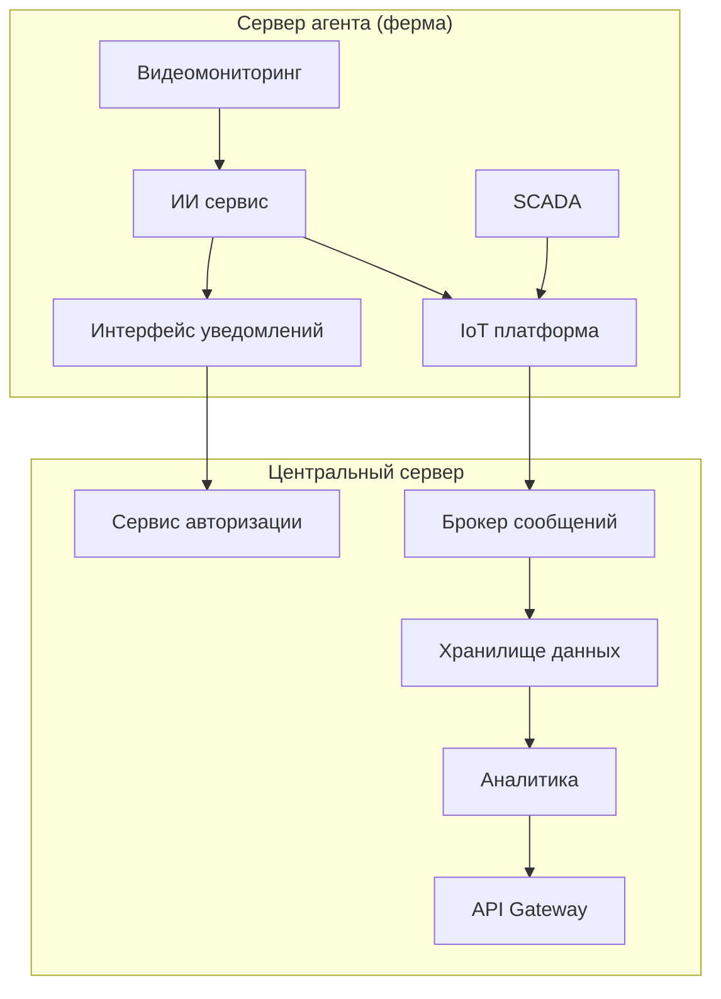

# ADR-2: Размещение контура видеоаналитики и реагирования в распределённой платформе мониторинга скота

**Статус:** ✅ Принято  
**Участники:** Архитектор решения, технический лидер платформы, представитель бизнеса АгроТех Х, инженер эксплуатации, инженер по данным  
**Дата:** 2026-03-30  

---

## 1. Контекст

Текущая архитектура АгроТех Х не позволяет гарантированно обеспечить необходимую скорость обработки событий на ферме и устойчивое реагирование при нестабильной связи с центральной системой.

Система должна анализировать видеопоток с камер, выявлять нештатные ситуации в животноводстве и уведомлять дежурного сотрудника не позднее чем через 5 секунд после фиксации инцидента. При этом видеоаналитика должна работать в режиме, близком к реальному времени, а сама система — сохранять работоспособность даже при отсутствии интернета.

Для бизнеса важно выбрать архитектурный вариант, который не только решает задачу функционально, но и дает предсказуемый баланс между скоростью реакции, стоимостью внедрения, сложностью сопровождения и масштабированием на новые фермы.

Рассматривались два варианта:
1. **Edge-first** — логика видеоаналитики и локального реагирования размещается на сервере-агенте на ферме.
2. **Central-first** — логика видеоаналитики и реагирования размещается в центральном сервере, а на ферме остаются сбор данных, SCADA, буферизация и синхронизация.

---

## 2. Требования

### Функциональные

**FURPS+**:

| Категория | Требование |
|---|---|
| **F**unctional | Получать видеопотоки с камер разных производителей; выявлять драки, беспокойство, задавливание поросят, болезнь, гибель; собирать телеметрию с кормушек, поилок, систем фильтрации воды и запасов еды; передавать события и метрики в центральную платформу; предоставлять API для web/mobile |
| **U**sability | Дежурный сотрудник должен быстро получать понятные уведомления об инцидентах и видеть их в интерфейсе мониторинга |
| **R**eliability | Система должна продолжать работу на ферме даже при потере связи с центром с последующей синхронизацией |
| **P**erformance | Видеоаналитика должна обрабатывать поток с минимальной задержкой; оповещение должно формироваться не позднее 5 секунд |
| **S**upportability | Решение должно позволять дорабатывать существующие IoT/SCADA/хранилища и развивать новые сервисы без полного пересмотра архитектуры |

### Нефункциональные

| Категория | Требование | Критичность |
|---|---|---|
| Производительность | От момента возникновения нештатной ситуации, зафиксированной с помощью видеоаналитики, должно проходить не более 5 секунд до момента оповещения | Высокая |
| Производительность | Видеоаналитика должна реагировать в реальном времени, с задержкой порядка миллисекунд на критическом контуре | Высокая |
| Надёжность | Система должна работать при отсутствии интернета и синхронизироваться с центральной системой после восстановления связи | Высокая |
| Отказоустойчивость | Требуемая доступность платформы — 99,95% | Высокая |
| Масштабируемость | Архитектура должна поддерживать рост числа ферм и камер без пересмотра базового решения | Средняя |
| Расширяемость | Новый функционал должен добавляться без существенного изменения уже существующих компонентов | Высокая |
| Безопасность | Должны поддерживаться ролевой доступ, аутентификация и авторизация пользователей | Высокая |

---

## 3. Решение

### Описание

Было принято выбрать **вариант Edge-first**: разместить критичный по задержке контур на сервис-агенте фермы — приём видеопотока, обработку видео, AI-видеоаналитику и локальный интерфейс оповещения. Центральный сервер сохраняет функции корпоративной интеграции, хранения, аналитики, API и управления доступом.

Это решение соответствует ключевой бизнес-цели: минимизировать потери поголовья за счёт быстрого локального обнаружения инцидентов и немедленного уведомления сотрудника на месте.

### Аргументация

| Критерий | Обоснование |
|---|---|
| Выполнение SLA по оповещению не более 5 секунд | Локальная обработка на ферме исключает критическую зависимость от связи с центральным сервером и сокращает длину критического пути |
| Реакция видеоаналитики в реальном времени | Передача видеоданных внутри локального контура позволяет минимизировать задержку по сравнению с централизованной обработкой |
| Автономность при отсутствии связи | Локальный контур на ферме продолжает анализировать видео и показывать инциденты сотруднику даже при отсутствии связи |
| Переиспользование исторического ландшафта | IoT-шлюз, SCADA, Kafka, Data Lake, DWH и аналитика не заменяются полностью, а переиспользуются и дорабатываются |
| Чёткое разделение ответственности | Edge-контур отвечает за быстрые локальные реакции, центральный контур — за интеграцию, хранение, отчётность, BI, API и управление доступом |

#### Последствия

**✅ Положительные:**
- Архитектура соответствует ключевым требованиям по задержке и локальному реагированию
- Снижается зависимость оповещения от качества интернет-канала
- В центр передаются уже события, метрики и агрегаты, а не полный видеопоток
- Исторические корпоративные компоненты могут быть переиспользованы

**⚠️ Негативные:**
- Стоимость внедрения и поддержки возрастает из-за размещения AI-контура на каждой ферме
- Усложняется эксплуатация распределённой edge-инфраструктуры
- Обновление моделей и ПО на множестве ферм требует отдельного процесса доставки и контроля версий

**↗️ Зависимости:**
- Доработка существующего IoT-шлюза под маршрутизацию событий и метрик с фермы
- Интеграция SCADA с локальным edge-контуром и центральной шиной данных
- Организация централизованного управления версиями CV model и конфигурацией агентов
- Реализация защищённого API и авторизации для web/mobile и локального интерфейса

---

## 4. Критерии сравнения и анализ вариантов

### 4.1. Критерии сравнения решений

| Критерий | Вес | Почему важен для бизнеса |
|---|---:|---|
| Скорость реакции и выполнение SLA | 25 | Это напрямую влияет на снижение потерь поголовья и на ценность всей системы |
| Автономность при отсутствии связи | 20 | На фермах нестабильная связь, система должна продолжать работать локально |
| Надёжность и устойчивость к сбоям | 15 | Потеря инцидентов или остановка обработки на критическом участке приводит к прямому ущербу |
| Стоимость инфраструктуры на фермах | 10 | Чем выше требования к edge-серверу, тем дороже масштабирование по фермерской сети |
| Простота сопровождения и обновления моделей | 10 | Бизнесу важно контролировать стоимость эксплуатации и скорость изменений |
| Масштабирование на новые фермы и камеры | 10 | Решение должно выдерживать рост количества площадок и видеопотоков |
| Нагрузка на сеть и каналы связи | 5 | Чем больше видео гоняется в центр, тем выше риски и стоимость каналов |
| Скорость вывода MVP | 5 | Важно начать внедрение без чрезмерной задержки |

### 4.2. Анализ вариантов по критериям

Шкала оценки: **1 — очень плохо, 5 — очень хорошо**.

| Критерий | Вес | Edge-first: логика на сервере-агенте | Central-first: логика в центре |
|---|---:|---|---|
| Скорость реакции и выполнение SLA | 25 | **5/5** — минимальный критический путь, локальный inference и локальное оповещение | **2/5** — зависимость от передачи видео в центр, риск не уложиться в SLA |
| Автономность при отсутствии связи | 20 | **5/5** — ферма продолжает анализировать видео и показывать инциденты локально | **1/5** — при потере связи критичный AI-контур фактически недоступен |
| Надёжность и устойчивость к сбоям | 15 | **4/5** — сбой в центре не останавливает локальную реакцию | **3/5** — проще централизованно резервировать, но отказ канала ломает обработку |
| Стоимость инфраструктуры на фермах | 10 | **2/5** — дороже, нужен более сильный edge-контур | **5/5** — основные вычисления вынесены в центр |
| Простота сопровождения и обновления моделей | 10 | **3/5** — сложнее управлять множеством edge-узлов | **5/5** — одна точка обновления моделей и логики |
| Масштабирование на новые фермы и камеры | 10 | **4/5** — масштабируется по фермам, но требует edge-ресурсов | **3/5** — масштабируется централизованно, но растёт давление на сеть и центр |
| Нагрузка на сеть и каналы связи | 5 | **5/5** — в центр уходят события и метрики, а не полный видеопоток | **2/5** — видеоданные перегружают канал и повышают стоимость связи |
| Скорость вывода MVP | 5 | **3/5** — сложнее развернуть на местах | **4/5** — быстрее собрать единый контур в центре |

### 4.3. Сводная оценка

| Вариант | Итоговый взвешенный балл |
|---|---:|
| **Edge-first** | **415 / 500** |
| **Central-first** | **275 / 500** |

### 4.4. Альтернативы

| Вариант | Плюсы | Минусы | Почему отклонён |
|---|---|---|---|
| Разместить логику видеоаналитики и реагирования в центральном сервере | Проще сопровождать AI-модели и обновлять ПО; меньше вычислительная нагрузка на фермах; централизованный контроль | Высокая зависимость от качества связи; рост сетевого трафика из-за передачи видео; риск не выполнить требования по миллисекундной реакции и оповещению за 5 секунд; снижение автономности фермы | Не обеспечивает надёжное выполнение критичных бизнес-требований по сохранению поголовья и быстрому реагированию |

### 4.5. Личное резюме и рекомендация

Моё резюме как архитектора: **для данной задачи бизнесу следует выбирать Edge-first решение**.  
Причина простая: в этой системе критична не удобная эксплуатация моделей сама по себе, а способность **заметить инцидент быстро, локально и без зависимости от канала связи**. Если система не укладывается в несколько секунд или перестаёт работать при сбое интернета, то она не решает главную бизнес-задачу — снижение потерь поголовья и повышение операционной управляемости на ферме.

Central-first вариант выглядит привлекательнее по сопровождению и стоимости на объекте, но в реальности он проигрывает по самому важному набору критериев: скорости реакции, автономности и устойчивости в условиях нестабильной связи. Поэтому его можно рассматривать только как архитектурную альтернативу или как возможный следующий этап эволюции системы, но **не как рекомендуемое решение для основного MVP и производственного внедрения**.

---

## 5. Риски

1. **Недостаточная производительность edge-сервера на ферме**  
   *Меры:* зафиксировать минимальные требования к CPU/GPU и памяти; провести нагрузочное тестирование на целевом количестве камер; предусмотреть деградационные режимы и масштабирование по edge-устройствам.

2. **Сложность централизованного обновления AI-моделей и конфигураций на множестве ферм**  
   *Меры:* внедрить централизованный процесс rollout/rollback версий, контроль совместимости моделей и конфигураций, журнал версий и поэтапное обновление по группам ферм.

3. **Потеря или задержка синхронизации данных между фермой и центральной платформой**  
   *Меры:* использовать локальную буферизацию событий на агенте, гарантированную повторную отправку после восстановления связи, мониторинг отставания синхронизации и алерты на сбои интеграции.