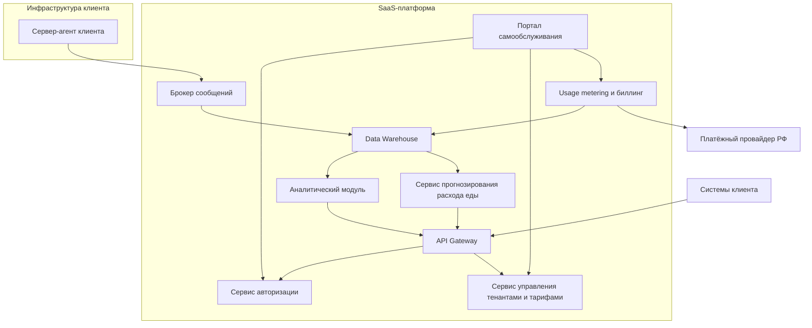

# ADR-3: Выбор стратегии мультитенантной изоляции данных для SaaS-платформы

**Статус:** ✅ Принято  
**Участники:** Архитектор решения, технический лидер платформы, представитель бизнеса АгроТех Х, инженер эксплуатации, инженер по данным, product owner SaaS-направления  
**Дата:** 2026-03-30  

---

## 1. Контекст

В ADR-2 в качестве базовой архитектуры платформы был принят вариант **Edge-first**: критичный контур видеоаналитики и локального реагирования размещается на сервере-агенте на ферме, а центральная платформа отвечает за хранение, аналитику, API и управление доступом.

После успешного внедрения MVP на собственных фермах компания планирует вывести решение на рынок как коммерческую **SaaS-платформу** для других агрохолдингов. Это требует мультитенантной архитектуры, которая позволит обслуживать несколько клиентов на единой платформе и одновременно обеспечивать:
- полную изоляцию данных между клиентами;
- гибкую систему подписок и тарифных планов;
- API для интеграции с системами клиентов;
- панель самообслуживания для управления аккаунтом;
- горизонтальное масштабирование;
- сбор usage-метрик для аналитики и биллинга;
- интеграцию с российскими платёжными системами;
- документацию и API для самостоятельного онбординга.

Ключевой вопрос:
**какой вариант изоляции данных использовать как базовую мультитенантную модель SaaS-платформы, построенной поверх принятого Edge-first решения.**

Рассматривались три варианта:
1. **Изоляция на уровне схем БД** — общая платформа и общая БД, но отдельная схема на каждого клиента.
2. **Изоляция на уровне отдельных БД** — общая платформа, но отдельная БД на каждого клиента.
3. **Изоляция на уровне отдельных инстансов** — отдельный экземпляр платформы на каждого клиента.

---

## 2. Требования

### Функциональные

**FURPS+**:

| Категория | Требование |
|---|---|
| **F**unctional | Обслуживать несколько клиентов на единой платформе; обеспечивать изоляцию данных между клиентами; поддерживать тарифы и подписки; предоставлять API для интеграции; собирать usage-метрики; поддерживать самообслуживание аккаунта |
| **U**sability | Клиент должен иметь кабинет самообслуживания для управления аккаунтом, тарифом, API-ключами и подключениями; должна быть доступна документация и онбординг |
| **R**eliability | Платформа должна корректно изолировать tenant-данные и устойчиво работать при росте числа клиентов |
| **P**erformance | Платформа должна горизонтально масштабироваться по мере роста количества клиентов и не деградировать критически по времени отклика |
| **S**upportability | Архитектура должна позволять быстро подключать новых клиентов, добавлять тарифы и интеграции без ручной пересборки платформы |

### Нефункциональные

| Категория | Требование | Критичность |
|---|---|---|
| Безопасность | Полная изоляция данных между клиентами | Высокая |
| Масштабируемость | Горизонтальное масштабирование по мере роста числа клиентов | Высокая |
| Экономика | Приемлемая стоимость владения платформой и снижение TCO для клиентов | Высокая |
| Time-to-market | Быстрый вывод SaaS на рынок и быстрый онбординг новых клиентов | Высокая |
| Эксплуатация | Управляемая сложность сопровождения платформы | Средняя |
| Биллинг | Сбор usage-метрик и интеграция с российскими платёжными системами | Высокая |
| ML/аналитика | Возможность собирать данные для развития собственных ML-моделей | Высокая |

---

## 3. Решение

### Описание

Было принято выбрать **мультитенантную архитектуру с изоляцией на уровне схем БД** как базовый SaaS-вариант.

При этом сохраняется базовый принцип из ADR-2:
- у каждого клиента остаются собственные **серверы-агенты** на фермах;
- критичный контур видеоаналитики и локального реагирования остаётся на стороне клиента;
- центральная SaaS-платформа становится общим **control plane** и **data plane** для нескольких тенантов.

Выбранная модель предполагает:
- общие SaaS-сервисы для всех клиентов;
- единый `API Gateway`, `Сервис авторизации`, `Usage metering и биллинг`, `Аналитический модуль`;
- tenant-aware доступ во всех сервисах;
- хранение tenant-данных в отдельных схемах внутри общей БД;
- сохранение возможности перевода отдельных клиентов на более сильные режимы изоляции: отдельные БД или отдельные инстансы.

### Аргументация

| Критерий | Обоснование |
|---|---|
| Быстрый вывод SaaS на рынок | Изоляция на уровне схем БД требует минимального provisioning и позволяет быстро подключать новых клиентов |
| Экономика SaaS | Общая платформа и shared-инфраструктура дают лучшую юнит-экономику |
| Масштабируемость | Общие SaaS-сервисы проще масштабировать горизонтально, чем набор отдельных tenant-инстансов |
| Онбординг и self-service | Новый клиент подключается без развёртывания отдельного инстанса: достаточно создать tenant, схему БД, ключи и тариф |
| Usage billing и подписки | Централизованный сбор usage-метрик и биллинг проще реализуются в shared SaaS-модели |
| Сбор данных для аналитики и ML | Централизованная платформа упрощает агрегацию обезличенных данных и развитие собственных ML-моделей |
| Путь развития | Для клиентов с повышенными требованиями можно сохранить возможность миграции в режим отдельных БД или отдельных инстансов |

#### Последствия

**✅ Положительные:**
- Быстрое подключение новых клиентов
- Наилучшая стартовая экономика SaaS-платформы
- Удобная база для тарифов, usage billing и self-service onboarding
- Централизованный сбор usage- и продуктовых метрик
- Сохранён путь эволюции к более сильной изоляции для enterprise-клиентов

**⚠️ Негативные:**
- Изоляция слабее, чем при отдельных БД или отдельных инстансах
- Требуется строгий tenant-aware access control
- Ошибка в tenant context может привести к риску пересечения данных
- Часть enterprise-клиентов может не принять shared DB как базовый вариант

**↗️ Зависимости:**
- Tenant management
- IAM / Auth
- Usage metering и billing
- Интеграция с российскими платёжными системами
- Портал самообслуживания и документация
- Tenant-aware access layer в API и аналитических сервисах

---

## 4. Критерии сравнения каждого решения

### 4.1. Критерии сравнения

| Критерий | Вес | Почему важен для бизнеса |
|---|---:|---|
| Изоляция и безопасность данных | 25 | Это базовое требование SaaS и главный фактор доверия клиентов |
| Стоимость платформы | 20 | Влияет на юнит-экономику SaaS и маржинальность |
| Скорость подключения новых клиентов | 15 | Важна для масштабирования и скорости продаж |
| Сложность эксплуатации | 10 | Чем сложнее сопровождение, тем выше OPEX |
| Горизонтальное масштабирование | 10 | SaaS должен расти без пропорционального роста сложности |
| Поддержка enterprise-клиентов | 10 | Крупные клиенты могут требовать усиленную изоляцию |
| Простота биллинга и usage metering | 5 | Это нужно для монетизации и прозрачных тарифов |
| Сбор данных для ML и аналитики | 5 | Важен для развития продукта и собственных моделей |

### 4.2. Анализ вариантов по критериям

Шкала оценки: **1 — очень плохо, 5 — очень хорошо**.

| Критерий | Вес | Схемы БД | Отдельные БД | Отдельные инстансы |
|---|---:|---:|---:|---:|
| Изоляция и безопасность данных | 25 | 3 | 4 | 5 |
| Стоимость платформы | 20 | 5 | 3 | 1 |
| Скорость подключения новых клиентов | 15 | 5 | 4 | 2 |
| Сложность эксплуатации | 10 | 4 | 3 | 1 |
| Горизонтальное масштабирование | 10 | 4 | 4 | 3 |
| Поддержка enterprise-клиентов | 10 | 3 | 4 | 5 |
| Простота биллинга и usage metering | 5 | 5 | 4 | 3 |
| Сбор данных для ML и аналитики | 5 | 5 | 4 | 2 |

### 4.3. Сводная оценка

| Вариант | Итоговый взвешенный балл |
|---|---:|
| **Изоляция на уровне схем БД** | **410 / 500** |
| **Изоляция на уровне отдельных БД** | **375 / 500** |
| **Изоляция на уровне отдельных инстансов** | **290 / 500** |

---

## 5. Анализ вариантов системы

### Вариант 1. Изоляция на уровне схем БД

**Суть:**  
Все клиенты используют общие SaaS-сервисы. В общей БД каждому клиенту выделяется отдельная схема.

**Плюсы:**
- минимальная стоимость запуска и эксплуатации;
- быстрый onboarding нового клиента;
- простая горизонтальная масштабируемость сервисов;
- лучший вариант для стартовой SaaS-модели;
- проще всего собирать usage-метрики и продуктовую аналитику.

**Минусы:**
- логическая изоляция слабее, чем физическая;
- требует строгого tenant-aware контроля доступа;
- подходит не всем enterprise-клиентам.

**Вывод:**  
Лучший базовый вариант для SaaS-платформы на старте.

### Вариант 2. Изоляция на уровне отдельных БД

**Суть:**  
Сервисы SaaS остаются общими, но каждому клиенту выделяется отдельная БД.

**Плюсы:**
- более сильная изоляция данных;
- проще объяснять enterprise-клиентам модель хранения;
- легче мигрировать, архивировать и обслуживать tenant-данные отдельно.

**Минусы:**
- выше стоимость эксплуатации;
- сложнее provisioning и управление большим числом БД;
- usage billing и агрегированная аналитика становятся сложнее.

**Вывод:**  
Хороший вариант для enterprise-тарифа или для клиентов с повышенными требованиями к изоляции.

### Вариант 3. Изоляция на уровне отдельных инстансов

**Суть:**  
Для каждого клиента поднимается отдельный экземпляр SaaS-платформы.

**Плюсы:**
- максимальная изоляция;
- наибольшая свобода кастомизации;
- подходит для private SaaS / стратегических клиентов.

**Минусы:**
- самая высокая стоимость инфраструктуры и сопровождения;
- медленный onboarding;
- слабая экономика для массового SaaS;
- сложнее собирать и консолидировать usage-метрики и данные для ML.

**Вывод:**  
Подходит только как специальный premium/private вариант, но не как базовая SaaS-модель.

---

## 6. Альтернативы

| Вариант | Плюсы | Минусы | Почему не выбран как базовый |
|---|---|---|---|
| Изоляция на уровне отдельных БД | Более сильная изоляция, чем у схем; подходит для enterprise | Дороже и сложнее в сопровождении | Подходит как enterprise-вариант, но хуже стартовой экономики SaaS |
| Изоляция на уровне отдельных инстансов | Максимальная изоляция и кастомизация | Самая дорогая и сложная модель | Не подходит как базовый режим из-за плохой экономики и медленного масштабирования |

---

## 7. Личное резюме и рекомендация

Рекомендую строить SaaS-платформу **на базе принятого Edge-first варианта из ADR-2** и использовать **изоляцию на уровне схем БД** как основной мультитенантный режим.

Это решение лучше всего соответствует целям бизнеса:
- ускоряет выход на рынок;
- позволяет быстро подключать новых клиентов;
- даёт лучший баланс между безопасностью, стоимостью и масштабированием;
- упрощает подписки, usage billing и self-service onboarding;
- сохраняет централизованный сбор данных для аналитики и будущих ML-моделей.

При этом для крупных клиентов необходимо заранее предусмотреть два более дорогих режима:
- **отдельные БД** как enterprise-уровень изоляции;
- **отдельные инстансы** как private SaaS / strategic вариант.

---

## 8. Риски

1. **Ошибки tenant-изоляции в shared SaaS-платформе**  
   *Меры:* обязательный tenant context во всех запросах, централизованный tenant-aware middleware, автоматические тесты на изоляцию данных.

2. **Рост сложности продуктовой модели при поддержке нескольких уровней изоляции**  
   *Меры:* формализовать уровни изоляции как тарифы: Standard = schema-per-tenant, Enterprise = database-per-tenant, Private = instance-per-tenant.

3. **Сложность usage billing при росте числа клиентов**  
   *Меры:* выделить usage metering как отдельный сервис, хранить usage-события отдельно от продуктовых данных, реализовать идемпотентный billing pipeline.

4. **Ограничения enterprise-клиентов на использование shared SaaS**  
   *Меры:* заранее предусмотреть миграционный путь на отдельные БД и отдельные инстансы.

5. **Сложность консолидации данных для ML при усиленной изоляции enterprise-клиентов**  
   *Меры:* определить политику согласий, обезличивания и экспорта данных в общий ML data plane, а для чувствительных клиентов использовать opt-in подход.